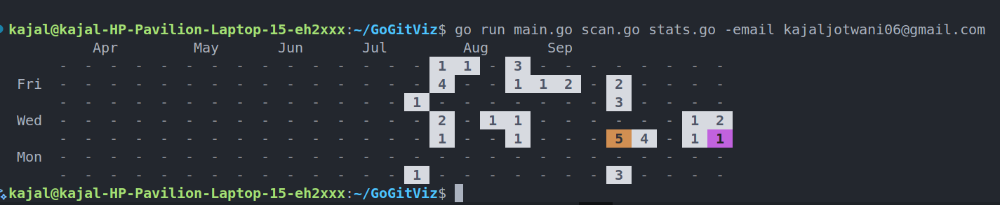

# GoGitViz
GoGitViz is a simple terminal tool that visualizes your local Git commit history in a GitHub-style contributions graph.

Unlike GitHub or GitLab, which only show commits pushed to their servers, GoGitViz scans your local repositories and builds a contributions heatmap based on your commits -- across all projects and remotes combined.

This means you get a complete picture of your coding activity, even if you:

- Work on both GitHub and GitLab
- Keep private or offline repositories
- Contribute across multiple accounts

With GoGitViz, your contribution graph reflects your true local commit history.



## Features
- Scan your machine for local Git repositories.
- Track commits by email.
- Generate a contributions graph for the past 6 months (configurable).
- Colored terminal heatmap like GitHub.

## Installation

1. Clone the repository:
```bash
git clone https://github.com/your-username/GoGitViz
cd GoGitViz
```

2. Install dependencies:
```bash
go mod tidy
```

3. Build the executable:
```bash
go build -o gogitvis
```

4. (Optional) Add to PATH for global access:
```bash
sudo mv gogitvis /usr/local/bin/
```
## Usage

1. **Add repositories to track**
   
   First, add the folders containing your Git repositories:
   ```bash 
   ./gogitvis -add ~/code        # Add specific folder
   ./gogitvis -add ~            # Add home directory
   ./gogitvis -add .            # Add current directory
   ```

2. **View your commit statistics**
   
   Generate a visualization of your commits:
   ```bash 
   ./gogitvis -email "your@email.com"
   ```
   Use the email address associated with your Git commits.

3. **Customize time range**
   
   Change the number of months to display (default is 6):
   ```bash 
   ./gogitvis -email "your@email.com" -months 12
   ```

4. **Tips**
   - Make sure to use the same email address that you use for your Git commits
   - You can add multiple folders to scan by running the -add command multiple times
   - The tool stores repository locations in `~/.gogitlocalstats`
